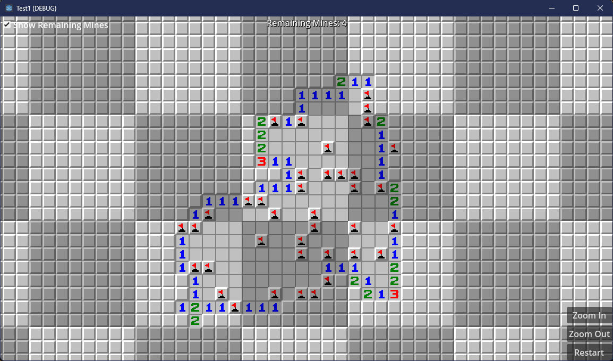
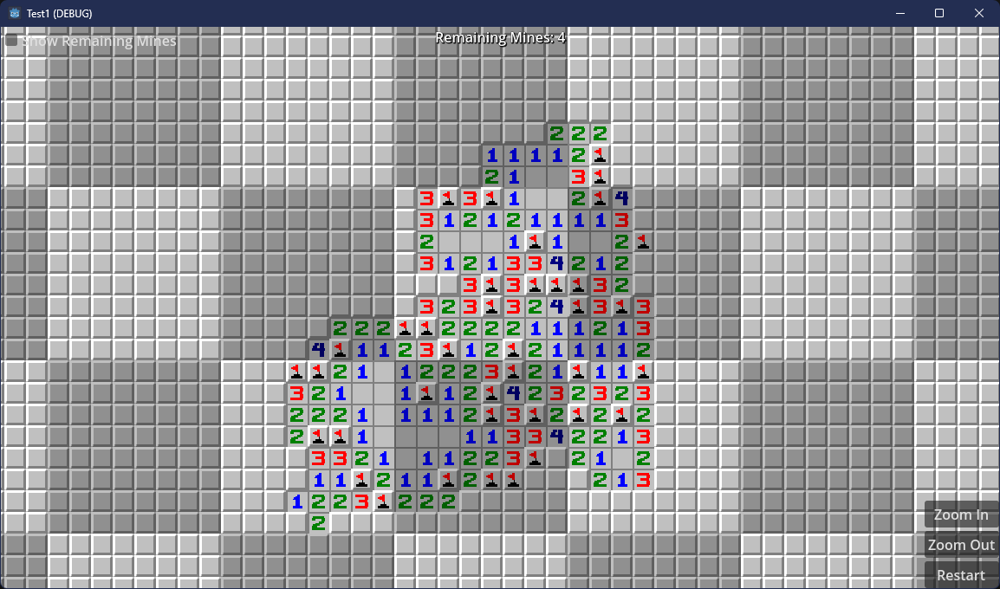

# Infinite Minesweeper

A Godot 4 C# project implementing an infinite, randomly generated Minesweeper game.

## Features

- **Infinite World:** The minefield is generated in chunks as you explore, so you can play endlessly.
- **Classic Gameplay:** Flag, explore, and avoid mines just like the original Minesweeper.
- **Zoom & Pan:** Use zoom in/out and camera controls to navigate the infinite field.
- **UI:** Remaining mines counter, restart button, and toggle for showing remaining mines.

## Screenshots & Assets

| With only remaining mines | With all mines |
|-----------|-----------|
|  |  |

## Getting Started

1. [Clone this repository](https://github.com/FaustVX/InfiniteMinesweeper.Godot.git).
2. [Open the project in Godot 4](https://godotengine.org/download/) ([Mono/C# version net 8.0](https://dotnet.microsoft.com/download/dotnet/8.0)).
3. Build and run the project.

## Controls

- **Left Click:** Explore a cell
- **Right Click:** Flag a cell
- **Mouse Wheel / Zoom Buttons:** Zoom in/out
- **`Ctrl` + `R` / Restart Button:** Restart the game
